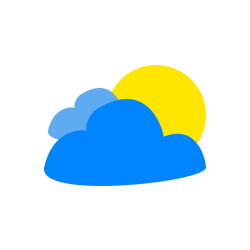

>#### :heart: Primeira versão finalizada v1.0

[Link para vizualização da página](https://rafaelbarbosa17-weather-app-ts.netlify.app/)

    
    <h1 align="center"> Weather APP </h1>

> Esta logo foi desenvolvida por mim e está disponivel para uso.

    

Este é um aplicativo simples que utiliza uma API de clima, a [OpenWeatherMap API](https://openweathermap.org/api), o aplicativo mostra o clima atual de acordo com sua localização e também exibe a hora com um relógio funcional, agora o aplicativo também é capaz de gerar cenarios de acordo com o clima e a hora o aplicativo é capaz de posicionar o sol de acordo com a hora do dia, gerar nuvens, relampagos e até mesmo a chuva e a neve.
